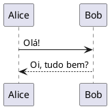

# PlantUML — Guia de Instalação e Referência Rápida

> Guia completo para instalar, configurar e utilizar o **PlantUML** localmente no **VS Code**.

---

## 📑 Índice

1. [O que é o PlantUML?](#o-que-é-o-plantuml)
2. [Pré-requisitos](#pré-requisitos)
3. [Instalação por Sistema Operacional](#instalação-por-sistema-operacional)
   - [Windows](#windows)
   - [macOS](#macos)
   - [Linux (Ubuntu/Debian)](#linux-ubuntudebian)
4. [Configuração no VS Code](#configuração-no-vs-code)
5. [Como usar](#como-usar)
6. [Estrutura de exemplos](#estrutura-de-exemplos)
7. [Links úteis](#links-úteis)

---

## O que é o PlantUML?

O [PlantUML](https://plantuml.com/) é uma ferramenta **open-source** que permite criar diagramas UML (e outros) a partir de uma linguagem de texto simples. Em vez de arrastar caixas em ferramentas gráficas, você **descreve** o diagrama em texto e o PlantUML gera a imagem automaticamente.

**Tipos de diagramas suportados:**

| Categoria | Exemplos |
|---|---|
| Estruturais | Classe, Componente, Pacote, Objetos |
| Comportamentais | Sequência, Casos de Uso, Atividade, Estados |
| Outros | Entidade-Relacionamento (ER), Gantt, Mind Map, JSON/YAML |

---

## Pré-requisitos

O PlantUML precisa do **Java** instalado na máquina (JRE ou JDK 8+). Verifique se já possui:

```bash
java -version
```

Se não tiver, instale o Java antes de prosseguir:

| SO | Comando / Instrução |
|---|---|
| **Windows** | Baixe o instalador em [adoptium.net](https://adoptium.net/) ou use `winget install EclipseAdoptium.Temurin.21.JDK` |
| **macOS** | `brew install openjdk` |
| **Linux** | `sudo apt install default-jdk` |

---

## Instalação por Sistema Operacional

### Windows

1. **Instale o Graphviz** (necessário para a maioria dos diagramas):

   - **Opção A — via Chocolatey:**
     ```powershell
     choco install graphviz
     ```
   - **Opção B — via winget:**
     ```powershell
     winget install Graphviz.Graphviz
     ```
   - **Opção C — manual:** Baixe em [graphviz.org/download](https://graphviz.org/download/) e adicione a pasta `bin` ao `PATH` do sistema.

2. **Verifique a instalação:**
   ```powershell
   dot -version
   ```

3. **(Opcional) Baixe o JAR do PlantUML:**
   ```powershell
   # Crie uma pasta para o PlantUML
   mkdir C:\tools\plantuml
   # Baixe o JAR (verifique a versão mais recente em https://plantuml.com/download)
   curl -L -o C:\tools\plantuml\plantuml.jar https://github.com/plantuml/plantuml/releases/latest/download/plantuml.jar
   ```

> **Nota:** Se você usar apenas a extensão do VS Code, o download do JAR é opcional — a extensão já embute uma versão do PlantUML.

---

### macOS

1. **Instale o Graphviz via Homebrew:**
   ```bash
   brew install graphviz
   ```

2. **Verifique a instalação:**
   ```bash
   dot -V
   ```

3. **(Opcional) Baixe o JAR do PlantUML:**
   ```bash
   brew install plantuml
   ```
   Ou manualmente:
   ```bash
   mkdir -p ~/tools/plantuml
   curl -L -o ~/tools/plantuml/plantuml.jar https://github.com/plantuml/plantuml/releases/latest/download/plantuml.jar
   ```

---

### Linux (Ubuntu/Debian)

1. **Instale o Graphviz:**
   ```bash
   sudo apt update
   sudo apt install graphviz
   ```

2. **Verifique a instalação:**
   ```bash
   dot -V
   ```

3. **(Opcional) Instale o PlantUML via apt:**
   ```bash
   sudo apt install plantuml
   ```
   Ou baixe o JAR manualmente:
   ```bash
   mkdir -p ~/tools/plantuml
   curl -L -o ~/tools/plantuml/plantuml.jar https://github.com/plantuml/plantuml/releases/latest/download/plantuml.jar
   ```

---

## Configuração no VS Code

### 1. Instale a extensão

Abra o VS Code e instale a extensão **PlantUML**:

- Pressione `Ctrl+Shift+X` (Windows/Linux) ou `Cmd+Shift+X` (macOS)
- Pesquise por **"PlantUML"**
- Instale a extensão de **jebbs** ([link direto no Marketplace](https://marketplace.visualstudio.com/items?itemName=jebbs.plantuml))

### 2. Configurações recomendadas

Abra as configurações do VS Code (`Ctrl+,` ou `Cmd+,`) e adicione ao `settings.json`:

```json
{
  "plantuml.render": "Local",
  "plantuml.exportFormat": "png",
  "plantuml.exportOutDir": "out"
}
```

| Configuração | Descrição |
|---|---|
| `plantuml.render` | `"Local"` usa o JAR local; `"PlantUMLServer"` usa servidor online |
| `plantuml.exportFormat` | Formato de exportação: `png`, `svg`, `pdf`, `eps`, etc. |
| `plantuml.exportOutDir` | Pasta de saída para diagramas exportados |

> **Dica:** Para renderização local, certifique-se de que o Java e o Graphviz estão instalados e no `PATH`.

### 3. Atalhos úteis no VS Code

| Atalho | Ação |
|---|---|
| `Alt+D` | Abre o preview do diagrama atual |
| `Ctrl+Shift+P` → "PlantUML: Export" | Exporta o diagrama para arquivo |
| `Ctrl+Shift+P` → "PlantUML: Preview" | Preview do diagrama |

> No **macOS**, substitua `Ctrl` por `Cmd`.

---

## Como usar

1. Crie um arquivo com extensão `.puml`, `.plantuml` ou `.wsd`
2. Escreva o código do diagrama (veja os exemplos abaixo)
3. Use `Alt+D` para visualizar o preview
4. Use `Ctrl+Shift+P` → **"PlantUML: Export Current Diagram"** para exportar

### Sintaxe básica

Todo diagrama PlantUML começa com `@startuml` e termina com `@enduml`:



---

## Estrutura de exemplos

Esta pasta contém exemplos organizados por tipo de diagrama:

```
plantUML/
├── README.md                  ← Você está aqui
├── 01-sequencia/              ← Diagramas de Sequência
│   ├── exemplo-basico.puml
│   └── exemplo-avancado.puml
├── 02-classes/                ← Diagramas de Classe
│   ├── exemplo-basico.puml
│   └── exemplo-heranca.puml
├── 03-casos-de-uso/           ← Diagramas de Casos de Uso
│   └── exemplo-sistema.puml
├── 04-atividade/              ← Diagramas de Atividade
│   └── exemplo-fluxo.puml
├── 05-estados/                ← Diagramas de Estados
│   └── exemplo-pedido.puml
├── 06-componentes/            ← Diagramas de Componentes
│   └── exemplo-arquitetura.puml
└── 07-er/                     ← Diagramas Entidade-Relacionamento
    └── exemplo-banco.puml
```

---

## Links úteis

| Recurso | Link |
|---|---|
| **Site oficial** | [plantuml.com](https://plantuml.com/) |
| **Referência de sintaxe** | [plantuml.com/sitemap-language-specification](https://plantuml.com/sitemap-language-specification) |
| **Guia de Diagramas de Sequência** | [plantuml.com/sequence-diagram](https://plantuml.com/sequence-diagram) |
| **Guia de Diagramas de Classe** | [plantuml.com/class-diagram](https://plantuml.com/class-diagram) |
| **Guia de Casos de Uso** | [plantuml.com/use-case-diagram](https://plantuml.com/use-case-diagram) |
| **Guia de Diagramas de Atividade** | [plantuml.com/activity-diagram-beta](https://plantuml.com/activity-diagram-beta) |
| **Guia de Diagramas de Estado** | [plantuml.com/state-diagram](https://plantuml.com/state-diagram) |
| **Guia de Diagramas de Componentes** | [plantuml.com/component-diagram](https://plantuml.com/component-diagram) |
| **Diagramas ER** | [plantuml.com/ie-diagram](https://plantuml.com/ie-diagram) |
| **Editor online (teste rápido)** | [www.plantuml.com/plantuml/uml](https://www.plantuml.com/plantuml/uml) |
| **Extensão VS Code** | [marketplace.visualstudio.com](https://marketplace.visualstudio.com/items?itemName=jebbs.plantuml) |
| **Repositório GitHub** | [github.com/plantuml/plantuml](https://github.com/plantuml/plantuml) |
| **Temas e estilos** | [the-lum.github.io/puml-themes-gallery](https://the-lum.github.io/puml-themes-gallery/) |

---

> **Dica final:** Explore os arquivos `.puml` nas subpastas para ver exemplos práticos. Abra cada arquivo no VS Code e pressione `Alt+D` para visualizar o diagrama gerado!
